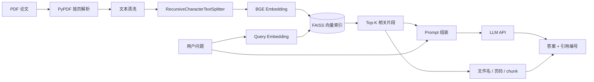

# 🌊 水声领域文献知识库 RAG 问答系统

> 个人项目：基于 **LangChain + BGE Embedding + FAISS + OpenAI-compatible LLM API** 搭建面向水声、信号处理与定位算法论文的检索增强生成（RAG）知识库，实现 PDF 文献解析、语义检索、带出处问答与轻量检索评测。

## 1. 项目背景

通用大模型在水声、信号处理等小众工科领域容易出现术语混淆、公式/数值编造以及文献出处不可追溯的问题。本项目将专业论文先构建为本地向量知识库，在回答问题前检索相关原文片段，再把检索结果作为上下文交给大模型生成答案。

核心目标：

- 让回答尽量建立在用户自己的专业文献上，而不是仅依赖模型参数记忆；
- 返回文件名、页码与 chunk 编号，便于回看原文；
- 让分块长度、重叠长度、Top-K 等参数可配置，方便做检索效果对比；
- Embedding 和 FAISS 全部可本地运行，LLM 通过可配置的 OpenAI-compatible API 接入。


---

## 2. 系统架构



### RAG 主链路

1. **文档加载**：递归扫描 `docs/` 下 PDF，使用 PyPDF 按页提取文本；
2. **文本清洗**：处理空字符、重复空格、异常换行，尽量保留段落结构；
3. **文本分块**：使用 `RecursiveCharacterTextSplitter`，默认 `chunk_size=800`、`chunk_overlap=120`；
4. **向量编码**：默认使用 `BAAI/bge-large-zh-v1.5`，并做向量归一化；
5. **向量索引**：使用 FAISS 构建本地索引，同时保存 source、page、chunk_id 等元数据；
6. **语义检索**：将用户问题向量化，召回 Top-K 相关文献片段；
7. **Prompt 约束**：要求模型只能依据检索上下文回答，证据不足时明确说明；
8. **结果输出**：答案中使用 `[1] [2] ...` 引用，命令行同时展示对应文件名、页码与 chunk。

---

## 3. 技术栈

- Python **3.10+**
- LangChain / LangChain Community
- LangChain Hugging Face Integration
- FAISS
- Sentence Transformers
- Embedding：`BAAI/bge-large-zh-v1.5`
- 文档解析：PyPDF
- LLM：任意 **OpenAI-compatible** Chat API（如兼容模式下的通义千问等）
- 可选 Web Demo：Streamlit

---

## 4. 项目目录

```text
RAG-Acoustic-Knowledge/
├── docs/
│   └── README.md                   # 本地放置 PDF，默认不提交论文原文
├── index/                          # 本地 FAISS 索引目录
├── tests/
│   └── test_data_process.py
├── .env.example                    # 配置模板
├── .gitignore
├── config.py                       # 项目统一配置
├── data_process.py                 # PDF 解析、文本清洗、分块
├── vector_store.py                 # Embedding、FAISS 构建/加载/检索
├── rag_chain.py                    # Prompt、LLM、RAG 问答链路
├── main.py                         # CLI 入口
├── evaluate.py                     # 轻量 Retrieval Hit@K 评测
├── eval_questions.example.json     # 评测问题模板
├── streamlit_app.py                # 可选 Web UI
├── requirements.txt
├── LICENSE
└── README.md
```

---

## 5. 安装

### 5.1 克隆项目

```bash
git clone <your-repository-url>
cd RAG-Acoustic-Knowledge
```

### 5.2 创建虚拟环境

```bash
python -m venv .venv
```

Windows：

```bash
.venv\Scripts\activate
```

macOS / Linux：

```bash
source .venv/bin/activate
```

### 5.3 安装依赖

```bash
pip install -r requirements.txt
```

> 第一次运行 BGE Embedding 时需要下载模型，CPU 可以运行但速度会比 GPU 慢。

---

## 6. 配置

复制配置模板：

```bash
cp .env.example .env
```

Windows PowerShell：

```powershell
Copy-Item .env.example .env
```

核心配置：

```env
DOCS_DIR=docs
INDEX_DIR=index/faiss
EMBEDDING_MODEL=BAAI/bge-large-zh-v1.5
EMBEDDING_DEVICE=cpu
CHUNK_SIZE=800
CHUNK_OVERLAP=120
TOP_K=4

LLM_MODEL=qwen-plus
LLM_API_KEY=replace_with_your_key
LLM_BASE_URL=https://dashscope.aliyuncs.com/compatible-mode/v1
TEMPERATURE=0.1
```

如果使用其他 OpenAI-compatible 服务，只需要替换 `LLM_MODEL`、`LLM_API_KEY` 和 `LLM_BASE_URL`。

---

## 7. 使用方法

### 7.1 放入论文

把你有权使用的 PDF 放到：

```text
docs/
```

PDF 默认不会被 Git 提交，避免把受版权保护的论文原文直接上传到公开仓库。

### 7.2 构建知识库

```bash
python main.py build
```

也可以覆盖默认分块参数：

```bash
python main.py build --chunk-size 1000 --chunk-overlap 150
```

构建完成后，`index/faiss/manifest.json` 会保存当前知识库的文档数、来源文件、Embedding 模型与分块参数。


### 7.3 RAG 问答

```bash
python main.py ask "声速剖面变化为什么会影响水下定位精度？"
```

输出结构：

```text
=== Answer ===

声速随深度变化会导致传播路径发生折射，从而使基于恒定声速或直线路径的测距模型产生偏差。[1][2]
...

=== Retrieved sources ===

[1] paper_a.pdf，第 4 页，chunk 18
[2] paper_b.pdf，第 7 页，chunk 31
```

### 7.4 连续对话模式

```bash
python main.py chat
```

### 7.5 查看索引信息

```bash
python main.py stats
```

### 7.7 Streamlit Web Demo

```bash
streamlit run streamlit_app.py
```

---

## 8. Prompt 约束策略

系统 Prompt 重点约束：

- 只根据检索上下文给出专业结论；
- 上下文不足时回答“当前知识库中未检索到足够证据”；
- 技术结论后增加 `[1] [2]` 引用；
- 禁止编造论文题目、作者、公式、数值、页码；
- 检索片段存在冲突时明确指出差异。

这类约束不能保证完全消除幻觉，但可以把“证据不足”变成显式状态，并让回答更容易人工核验。

---

## 9. 项目亮点

1. **端到端 RAG 链路**：覆盖 PDF 解析、切分、Embedding、FAISS、检索、Prompt、LLM 生成；
2. **可溯源**：保留 source / page / chunk_id，答案和原始证据可以对应；
3. **模块化**：Embedding、向量库、LLM、分块参数可以独立替换；
4. **可调试**：支持 Retrieval-only 模式，把“召回问题”和“生成问题”拆开分析；
5. **可评测**：提供轻量 Hit@K 脚本，便于验证 chunk 与 Top-K 调优效果；
6. **领域化**：面向水声、定位、多径、信号处理等专业论文，而非通用 FAQ 数据。

---

## 10. 后续优化方向

- 增加 BGE Reranker / Cross-Encoder，对初检 Top-N 结果二次排序；
- 增加 Parent Document Retrieval，兼顾小块检索精度与大块上下文完整性；
- 增加 BM25 + Dense Retrieval 的 Hybrid Search；
- 增加 PDF 表格、公式、图片的多模态解析；
- 使用 RAGAS / 自定义测试集做 Faithfulness、Context Recall 等评测；
- 支持多知识库、文档增量更新与索引版本管理；
- 部署为 FastAPI 服务并补充 Dockerfile。

---


## License

MIT
